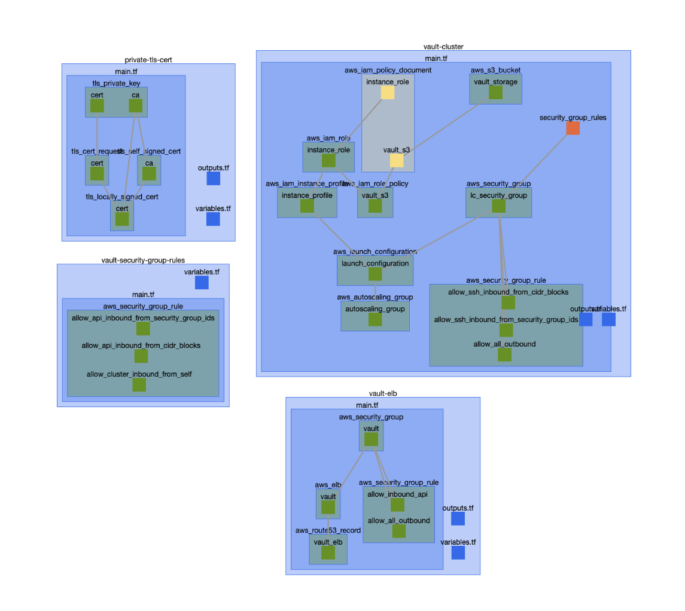

# Terraboard (WIP)

Inspired by [tensorboard](https://www.tensorflow.org/images/graph_vis_animation.gif). Terraboard is a visualizer and IDE for terraform.

Here is the visualization of [terraform-aws-vault](https://github.com/hashicorp/terraform-aws-vault) as an example.

## Usage

1. Make sure [nodejs](https://nodejs.org) is installed
2. Do `npm i -g terraboard`
3. In your terraform repository run `terraboard`
4. Open your browser to `localhost:3001`

## Roadmap
* Interactive visualization
* Sidebar with details
* Code editing
* Plan and apply visualization
